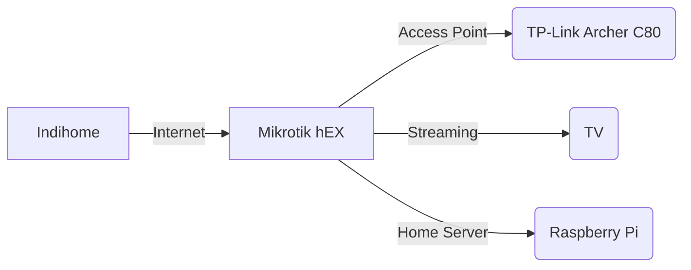

Pada artikel sebelumnya kita sudah merencanakan apa saja fitur yang akan kita pasang pada server. Pada artikel lanjutan ini, kita akan membangun server tersebut mulai dari *hardware* dan instalasi *software*.

## Mengenal Ansible⛵

[Ansible](https://www.ansible.com/) adalah *platform* otomasi infrastruktur yang dikembangkan oleh Red Hat. Program ini berbasis Python dan bersifat *open source* dan juga merupakan standar industri untuk melakukan otomasi dan menerapkan *Infrastructure-as-a-Code*.

Untuk membangun server ini, kita akan menggunakan Ansible dan *playbook* yang sudah penulis buat untuk melakukan *provisioning* server. *Playbook* merupakan kumpulan *task* yang dapat dieksekusi pada server, bisa dibilang *playbook* berisi urutan bagaimana server kita akan dibuat nantinya.

Tenang aja, penulis sudah membuatkan *playbook* yang bisa langsung dipakai, sehingga proses *povisioning* bisa dilakukan dengan cepat.

## Hardware Server⚙️

Sesuai judul dari artikel ini, kita akan menggunakan Raspberry Pi sebagai server. Bukan hanya Raspberry Pi saja yang kita butuhkan di server, kita juga perlu penyimpanan eksternal karena Raspberry Pi hanya bisa menggunakan MicroSD card yang ukurannya kecil.

Spesifikasi server penulis:

- Raspberry Pi 4 Model B - [Tokopedia](https://www.tokopedia.com/mechatron/raspberry-pi-4-model-b-8gb-paket-lengkap-siap-pakai-uk-pi4-8-gb-16gb)
- WD Caviar RED 2 TB - [Tokopedia](https://www.tokopedia.com/wd-official/wd-caviar-red-plus-2tb-hd-hdd-hardisk-internal-3-5-for-nas)
- UGREEN HDD Enclosure - [Tokopedia](https://www.tokopedia.com/storagexpertauthorized/ugreen-enclosure-hdd-ssd-usb-a-to-3-5-2-5-sata-us222)
- Mikrotik hEX (opsional) - [Tokopedia](https://www.tokopedia.com/pronetindo/mikrotik-rb750gr3-hex)

Perlu diingat kalau kita tidak terbatas untuk menggunakan Raspberry Pi saja sebagai server, tapi kita juga bisa menggunakan mini PC lain seperti Intel NUC, OrangePi, HP MicroServer, dan lainnya apalagi jika server ini nantinya ingin digunakan untuk *streaming* atau *game server*.


### Topologi Jaringan🔗

Agar aplikasi di server kita bisa di akses, tentunya kita perlu menghubungkan server kita ke jaringan rumah. Nah untuk topologi jaringan, bisa disesuaikan dengan kondisi jaringan masing-masing. Misalnya kalau teman-teman hanya punya satu router dari ISP, maka bisa menghubungkan langsung server ke router melalui Wi-Fi atau kabel *ethernet*.

> Penulis menyarankan untuk menggunakan kabel agar koneksi lebih reliabel

Berikut adalah contoh topologi jaringan di rumah penulis:



Teman-teman bisa langsung menghubungkan Raspberry Pi dengan *router* dari ISP, melalui *router* tambahan, melalui *switch*, atau cara lain selama teman-teman bisa mengakses Raspberry Pi melalui SSH.

## Provision Server🦄

Akhirnya setelah server kita sudah menyala, kita akan mulai untuk melakukan *provisioning* server. Beberapa tahapan yang akan kita lakukan adalah sebagai berikut.



### 1️⃣ Instalasi Raspbian OS

> Tutorial selengkapnya dapat dilihat di [Raspberry Documentation](https://www.raspberrypi.com/documentation/computers/getting-started.html).
>
> Pastikan kamu sudah mempunyai *micro SD card* dengan ukuran setidaknya 16 GB dan *power supply* yang sesuai (USB Type-C PD 15W)

Untuk dapat menggunakan Raspberry Pi, kita membutuhkan *micro SD card* untuk menginstall OS, pada percobaan ini kita akan menggunakan Raspbian OS.

Penulis tidak akan menjelaskan bagaimana cara menginstall Raspbian OS pada artikel ini, kamu bisa lihat tutorial lengkapnya di halaman dokumentasi Raspberry Pi. Tetapi, penulis berharap teman-teman nantinya sudah bisa mengakses Raspberry Pi menggunakan SSH.

### 2️⃣ Konfigurasi IP Statis, `cgroup`, dan Hardware Hack

Sebelum kita melanjutkan proses *provisioning*, ada beberapa hal yang perlu kita atur terlebih dahulu, yaitu mengatur IP statis tanpa DHCP, mengaktifkan `cgroup`, dan (opsional) mengaktifkan *hardware hack* untuk mengganti *storage driver*.

#### Konfigurasi IP Statis

Kenapa kita perlu mengatur IP statis? Karena kita tidak mau ketika ingin mengakses aplikasi seperti Jellyfin atau lainnya kita harus mencari IP baru dari server. Selain itu, ada beberapa komponen seperti DNSCrypt dan Pi-hole yang membutuhkan konfigurasi IP statis sebagai DNS server.

Cara untuk mengatur IP statis adalah dengan menggunakan `dhcpd`.

Langkah pertama adalah mencari IP yang digunakan oleh Raspberry Pi menggunakan perintah `ip r`.

```bash
$ ip r

default via 10.20.20.1 dev eth0 src 10.20.20.102 metric 202
10.20.20.0/24 dev eth0 proto dhcp scope link src 10.20.20.102 metric 202
172.17.0.0/16 dev docker0 proto kernel scope link src 172.17.0.1
172.18.0.0/16 dev br-d7ad1b433a07 proto kernel scope link src 172.18.0.1
```

Catat *interface* (eth0), *gateway* (10.20.20.1), dan IP (10.20.20.102/24) karena akan kita gunakan nanti. Untuk alamat DNS kita tidak perlu menggunakan DNS dari *router*, tapi kita akan gunakan server lain seperti 1.1.1.1 atau 8.8.8.8 sebagai alternatif, apalagi jika teman-teman akan menggunakan DNSCrypt dan Pi-hole.

Tahap selanjutnya adalah mengatur alamat IP statis, buka file `/etc/dhcpcd.conf` menggunakan `vim` atau editor lainnya. Kemudian tambahkan `denyinterfaces veth*` pada baris awal file dan konfigurasi *static IP* pada bagian bawah.

```bash
# A sample configuration for dhcpcd.
# See dhcpcd.conf(5) for details.

# ignore Docker virtual network interfaces
denyinterfaces veth*
.
.
# Example static IP configuration:
interface eth0
static routers=10.20.20.1
static ip_address=10.20.20.102/24
static domain_name_servers=1.1.1.1
```

Simpan file dan *restart* `dhcpd` menggunakan perintah `sudo systemctl restart dhcpcd.service`.

#### Konfigurasi `cgroup` dan *hardware hack*

Karena kita akan menggunakan Docker, sebaiknya kita mengaktifkan `cgroup` agar kita bisa mengatur penggunaan CPU dan memori yang digunakan oleh semua *container* aplikasi. Selain itu, `cgroup` juga diperlukan oleh cAdvisor untuk dapat memonitor penggunaan CPU dan memori dari semua *container* yang aktif.

Di sisi lain, *hardware hacks* yang penulis maksud di sini adalah penggunaan *driver* untuk media penyimpanan, yaitu *hard drive* yang tersambung melalui USB ke Raspberry Pi. Secara umum, Raspberry Pi akan menggunakan *driver* `uas` ketika kita menyambungkan perangkat penyimpanan, tetapi sayangnya *driver* ini memiliki beberapa keterbatasan yang utamanya membatasi *throughput IO*, sehingga kita perlu mengganti *driver* dari `uas` ke versi *driver* lama, yaitu `usb_storage`.

> Informasi detail mengenai [USB storage driver](https://smitchell.github.io/how-to-bind-to-the-right-usb-storage-driver).

Tahap pertama adalah mencari tahu VID dan PID dari perangkat USB yang tersambung. VID dan PID ini bersifat spesifik untuk setiap perangkat USB, sehingga bisa saja berbeda dengan versi penulis. Untuk mencari VID dan PID dari perangkat USB yang tersambung, gunakan perintah `lsusb -t`

```bash
$ lsusb

Bus 002 Device 002: ID 174c:1153 ASMedia Technology Inc. ASM1153 SATA 3Gb/s bridge
Bus 002 Device 001: ID 1d6b:0003 Linux Foundation 3.0 root hub
Bus 001 Device 003: ID 0a12:0001 Cambridge Silicon Radio, Ltd Bluetooth Dongle (HCI mode)
Bus 001 Device 002: ID 2109:3431 VIA Labs, Inc. Hub
Bus 001 Device 001: ID 1d6b:0002 Linux Foundation 2.0 root hub
```

Catat VID/PID perangkat penyimpanan yang tersambung, pada kasus ini VID/PID dari *hard drive enclosure* yang penulis gunakan adalah `174c:1153`.

Tahap selanjutnya adalah mengubah parameter *kernel*  ketika proses *booting* Raspberry Pi. Buka file `/boot/cmdline.txt`, kemudian tambahkan parameter berikut.

```plain
usb-storage.quirks=174c:1153:u ... cgroup_enable=cpuset cgroup_enable=memory cgroup_memory=1
```

Pastikan parameter `usb-storage.quirks` terdapat pada bagian awal dan berisi VID/PID dengan format `VID:PID:u`, dilanjutkan oleh konfigurasi yang sudah ada sebelumnya pada file `cmdline.txt`, dan terakhir tambahkan `cgroup_enable=cpuset cgroup_enable=memory cgroup_memory=1` pada bagian akhir baris. **PASTIKAN BAHWA SEMUA PARAMETER TEDAPAT PADA SATU BARIS. JIKA ADA LEBIH DARI SATU BARIS, KAMU MUNGKIN RASPBERRY PI KAMU TIDAK AKAN BISA BOOTING DAN PERLU DI EDIT MANUAL DI PC LAIN ATAU PERLU INSTALL ULANG RASPBIAN OS.**

Sampai di sini kita sudah selesai melakukan konfigurasi Raspberry Pi sebelum melakukan *provisioning* server. *Restart* Raspberry Pi menggunakan perintah `reboot` sebelum melanjutkan ke tahap berikutnya.

> Pastikan teman-teman juga sudah bisa mengakses *hard drive* dan memasang *mount point* yang dapat diakses.

### 3️⃣ *Provisioning* dengan Ansible

Akhirnya kita sampai pada tahap *provisioning*😂

Setelah server Raspberry Pi kita sudah memiliki IP statis, `cgroup` aktif, dan *driver USB* yang benar, kita bisa memulai proses *provisioning*. Perlu diingat bahwa proses *provisioning* ini bisa dilakukan untuk target server apapun, tidak harus Raspberry Pi!

Lakukan langkah-langkah di bawah ini pada komputer yang dapat terhubung dengan Raspberry Pi melalui SSH, **bukan** di server Raspberry Pi-nya.

1. Install Python (jika belum punya)
2. Install [Ansible](https://docs.ansible.com/ansible/latest/installation_guide/intro_installation.html) menggunakan pip dengan menjalankan perintah: `python3 -m pip install --user ansible`
3. `git clone https://github.com/fahminlb33/ritsu-pi.git`
4. Salin file `config.yml.example` menjadi `config.yml`, kemudian edit isi file config sesuai kebutuhan
5. Edit file `inventory.yml`, kemudian isikan alamat IP Raspberry Pi
6. Install Ritsu-Pi menggunakan perintah `ansible-playbook -i inventory.yml site.yml`

Jika proses konfigurasi sudah sesuai, maka teman-teman akan dapat melihat proses *provisioning* sebagai berikut.

```plain
TASK [exporter_mikrotik : Start and connect container to network] ****************************************************
ok: [ramiel]

TASK [exporter_speedtest : Pull image from registry] *****************************************************************
ok: [ramiel]

TASK [exporter_speedtest : Start and connect container to network] ***************************************************
ok: [ramiel]

PLAY RECAP ***********************************************************************************************************
ramiel                     : ok=66   changed=1    unreachable=0    failed=0    skipped=13   rescued=0    ignored=0
```

#### Membuat `inventory.yml`

File ini mengatur target server yang akan di-*provision*, secara umum kita hanya perlu menambahkan alamat IP dan *user* yang digunakan pada Raspberry Pi.

Contoh:

```yaml
ritsu_pi:
  hosts:
    ramiel:
      ansible_host: 10.20.20.102
      ansible_user: ramiel
```

#### Membuat `config.yml`

File ini menjelaskan apa saja fitur yang akan di-*install*. Secara *default*, konfigurasi awal ini akan memasang semua aplikasi yang tersedia pada Ritsu-Pi, seperti yang sudah dijelaskan pada [artikel sebelumnya](https://www.kodesiana.com/post/membangun-home-server-menggunakan-raspberry-pi-dan-ansible-bagian-1/).

Beberapa hal yang perlu diperhatikan ketika membuat konfigurasi Ritsu-Pi adalah:

1. `config_dir`, variabel ini mengatur lokasi konfigurasi aplikasi yang akan dipasang pada server. *Default*: `/media/primary/ritsi-pi2`, teman-teman bisa mengubah lokasi ini ke *hard drive* eksternal sesuai *mount point* yang sudah dibuat teman-teman
2. Pada setiap *components*, terdapat variabel `state`, jika nilainya `present` berarti komponen tersebut akan diinstall, jika nilainya `absent` maka komponen tersebut akan diabaikan

Konfigurasi lainnya dapat dilihat pada file `config.yml` dan teman-teman perlu mengubah konfigurasi sesuai kebutuhan.

### 4️⃣ Monitor Status Apps dan Uji Coba

Setelah teman-teman selesai melakukan *provisioning* menggunakan Ansible, tahap selanjutnya adalah melihat apakah semua *container* sudah aktif. Masuk ke server menggunakan SSH, kemudian jalankan perintah `docker ps`.

```bash
$ docker ps

CONTAINER ID   IMAGE                                         COMMAND                  CREATED        STATUS                PORTS                                                                              NAMES
9f3112dc9754   prom/prometheus:v2.48.0                       "/bin/prometheus --c…"   2 weeks ago    Up 4 days             0.0.0.0:8005->9090/tcp                                                             prometheus
ede638e9e275   miguelndecarvalho/speedtest-exporter:v3.5.4   "python -u exporter.…"   3 weeks ago    Up 4 days (healthy)   0/tcp, 0.0.0.0:8105->9798/tcp                                                      exporter_speedtest
9ee12fef27d8   ghcr.io/akpw/mktxp:stable-20230706091740      "/usr/local/bin/mktx…"   3 weeks ago    Up 4 days             0/tcp, 0.0.0.0:8103->49090/tcp                                                     exporter_mikrotik
7be4d2424b34   gcr.io/cadvisor/cadvisor:v0.47.2              "/usr/bin/cadvisor -…"   3 weeks ago    Up 4 days (healthy)   0/tcp, 0.0.0.0:8101->8080/tcp                                                      exporter_cadvisor
3484f51b3b38   portainer/portainer-ce:2.19.3                 "/portainer --bind :…"   3 weeks ago    Up 4 days             8000/tcp, 9443/tcp, 0.0.0.0:8004->9000/tcp                                         portainer
1622fc2c52d5   grafana/grafana:10.2.2                        "/run.sh"                3 weeks ago    Up 4 days             0.0.0.0:8001->3000/tcp                                                             grafana
aebba4071f0a   lscr.io/linuxserver/qbittorrent:4.6.1         "/init"                  3 weeks ago    Up 4 days             0.0.0.0:6881->6881/tcp, 0.0.0.0:8006->8006/tcp, 0.0.0.0:6881->6881/udp, 8080/tcp   qbittorrent
3c6a68a42059   jlesage/jdownloader-2:v23.11.2                "/init"                  3 weeks ago    Up 4 days             0.0.0.0:3129->3129/tcp, 5900/tcp, 0.0.0.0:8007->5800/tcp                           jdownloader
87b073530b76   pihole/pihole:2023.11.0                       "/s6-init"               3 weeks ago    Up 4 days (healthy)   0.0.0.0:53->53/tcp, 0.0.0.0:53->53/udp, 67/udp, 0.0.0.0:8003->80/tcp               pihole
f91516aaf4b2   klutchell/dnscrypt-proxy:v2.1.5               "dnscrypt-proxy -con…"   3 weeks ago    Up 4 days             0.0.0.0:54->5053/tcp, 0.0.0.0:54->5053/udp                                         dnscrypt
0b1de23ca7cc   jellyfin/jellyfin:10.8.12                     "/jellyfin/jellyfin"     3 weeks ago    Up 4 days (healthy)   0.0.0.0:8002->8096/tcp                                                             jellyfin
5e6e08245efa   ghcr.io/mlflow/mlflow:v2.7.1                  "mlflow server --hos…"   7 weeks ago    Up 4 days             0.0.0.0:8009->5000/tcp, :::8009->5000/tcp                                          mlflow
ad53c57eba1c   nginx:1.24.0-alpine                           "/docker-entrypoint.…"   7 months ago   Up 4 days             0.0.0.0:80->80/tcp, 0.0.0.0:443->443/tcp                                           nginx
e52e1ddfb0ff   fahminlb33/sensor-suhu-server:v1.0.1          "docker-entrypoint.s…"   7 months ago   Up 4 days             0/tcp, 0.0.0.0:8106->9000/tcp                                                      exporter_sensor_suhu_server
a3c5bcd7af6b   prom/blackbox-exporter:v0.23.0                "/bin/blackbox_expor…"   7 months ago   Up 4 days             0/tcp, 0.0.0.0:8102->9115/tcp                                                      exporter_blackbox
```

Jika semua *container* sudah aktif, kita sudah bisa mengakses semua aplikasi pada server sesuai dengan port yang kita atur pada file `config.yml`. Teman-teman bisa coba akses misalnya Portainer menggunakan alamat [http://10.20.20.102:8004](http://10.20.20.102:8004).

## Penutup💫

Pada artikel ini kita sudah berhasil meng-*install* Ritsu-Pi pada Raspberry Pi. Tentu saja masih ada proses konfigurasi yang perlu dilakukan misalnya untuk membuat *library* Jellyfin, mengatur akses MyJDownloader, mengatur akun awal untuk akses Portainer, Grafana, dan lain sebagainya, tapi penulis yakin teman-teman pasti bisa konfigurasi mandiri untuk aplikasi tersebut😬

Pada dua seri artikel ini kita telah belajar bagaimana cara mem-*provision* server Raspberry Pi menggunakan Ansible dan juga bagaimana Ansible bisa menjadi alternatif untuk membantu kita melakukan *provision* secara *centralized* dan juga *scalable* karena kita hanya perlu mengeksekusi perintah dari satu komputer saja.

Penulis juga memahami kalau artikel kali ini lebih rumit dari biasanya karena target audiens dari tutorial ini diharapkan sudah memiliki pengalaman dalam penggunaan Raspberry Pi dan Docker sebelumnya. Tinggalkan komentar kalau teman-teman punya pertanyaan mengenai cara konfigurasi Ritsu-Pi!

Terima kasih semuanya~

## Referensi📚

1. Fiqri, Fahmi Noor. 2023. [Ritsu-Pi Installation Guide](https://github.com/fahminlb33/ritsu-pi/blob/master/INSTALL.MD). Diakses 10 Desember 2023.
2. Raspberry Pi. 2023. [Getting Started](https://www.raspberrypi.com/documentation/computers/getting-started.html). Diakses 11 Desember 2023.
3. Red Hat. 2023. [Ansible](https://www.ansible.com/). Diakses 10 Desember 2023.
4. Red Hat. 2023 [Installing Ansible](https://docs.ansible.com/ansible/latest/installation_guide/intro_installation.html). Diakses 17 Desember 2023.
5. Mitchell, Steve. 2021. [How to bind to the right USB storage driver](https://smitchell.github.io/how-to-bind-to-the-right-usb-storage-driver). Diakses 17 Desember 2023.
