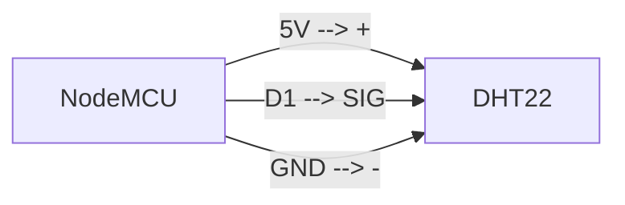

**Bogor** kota hujan. Kutipan tersebut mencerminkan bagaimana kondisi domisili penulis, sering hujan dan pastinya, lembap. Tahun 2023 lalu, penulis pernah menulis mengenai [*home server* berbasis Raspberry Pi](https://kodesiana.com/post/membangun-home-server-menggunakan-raspberry-pi-dan-ansible-bagian-1/) yang penulis gunakan untuk menyimpan data dan aplikasi. Nah karena sekarang musim hujan dan udara jadi makin lembap, kondisi ini biasanya tidak baik untuk server karena bisa menyebabkan degradasi/penurunan kinerja server.

Kali ini, penulis akan berbagi mengenai proyek kecil yang penulis buat pekan ini, yaitu alat untuk monitoring suhu dan humiditas server.

## Desain Sistem🪄

Pada artikel mengenai *home server*, penulis sudah memiliki sistem monitoring menggunakan *Prometheus* dan *Grafana*. Jadi, proyek kali ini penulis akan mengintegrasikan data suhu dan humiditas dari sensor ke *Prometheus* dan membuat *dashboard* menggunakan *Grafana*. Selain itu, penulis ingin membuat alat yang bisa ditempatkan di mana-mana dan juga hemat energi. Maka dari itu, penulis memilih alat yang akan dibuat nantinya perlu menggunakan Wi-Fi agar mudah ditempatkan di mana pun.

Konsep sistem yang akan penulis buat adalah sebagai berikut.


Nah sekarang kita sudah punya tujuan, selanjutnya kita akan membuat bagian *hardware* terlebih dahulu.

## Hardware🔧

Salah satu mikrokontroler yang populer dan memiliki konektivitas Wi-Fi adalah ESP8266 (board NodeMCU LOLIN v3). *Board* ini harganya sangat terjangkau dan bisa diprogram menggunakan Arduino IDE. Cocok untuk membuat prototipe alat. Selain itu, penulis juga menggunakan sensor DHT22 untuk mengukur suhu dan kelembapan udara.

- [Tokopedia: NodeMCU v4 LOLIN (ESP8266)](https://www.tokopedia.com/cncstorebandung/nodemcu-lolin-lua-wifi-v3-4mb-32mbits-ch340-flash-esp8266-esp12-board)
- [Tokopedia: DHT22](https://www.tokopedia.com/cncstorebandung/cnc-dht22-am2302-temperature-humidity-sensor-suhu-module-for-arduino)

Hubungkan pin-pin DHT22 dan NodeMCU seperti diagram berikut.



Contoh alat yang dibuat penulis:


Selesai! Karena ini proyek yang sangat sederhana, pada sisi *hardware* hanya cukup menghubungkan satu sensor dengan mikrokontroler. Sekarang, sambungkan NodeMCU dengan komputer menggunakan kabel USB untuk kita program.

## Firmware🧵

Nah sekarang kita akan mulai untuk memprogram *board* NodeMCU. Tapi sebelum itu, kita perlu meng-*install* *board*, *library*, dan konfigurasi jaringan yang nantinya akan disambungkan dengan server.

> Penulis menggunakan Arduino IDE versi 2.3.4.
> Pastikan kamu menggunakan versi yang sama atau lebih baru ya!

### Install Board ESP8266⚙️

Kalau kamu belum pernah menggunakan ESP8266 dengan Arduino IDE, cara menambahkan *board*-nya mudah. Klik `File > Preferences`, kemudian pada kolom `Additional boards manager URLs` tambahkan `https://arduino.esp8266.com/stable/package_esp8266com_index.json` dan klik OK.

Kemudian buka menu **Board Manager** dengan cara klik ikon *PCB* atau klik `Tools > Board > Board manager`. Pada kolom pencarian, ketikkan `esp8266` dan klik **Install** pada hasil pencarian pertama. Setelah meng-*install* *board*, jangan lupa pilih menu `Tools > Board > esp2866 > NodeMCU 0.9 (ESP-12 Module)` untuk mengaktifkan *firmware board* ini.

### Install Library DHT22🌡️

Mirip seperti pada proses sebelumnya, untuk meng-*install* *library*, kita bisa buka menu **Library Manager** dengan cara klik pada ikon buku atau menu `Sketch > Include Library > Manage library`. Cari `dht adafruit` kemudian *install* *library* dengan nama **DHT sensor library** yang dibuat oleh Adafruit. Ketika *install*, kamu mungkin diminta untuk ikut meng-*install* *library* *Adafruit Unified Library*, klik OK.

### Konfigurasi Jaringan🛜

Tahap ini merupakan salah satu tahapan yang paling penting karena kita akan mengintegrasikan *Prometheus* dan mikrokontroler. Pada dasarnya *Prometheus* dapat melakukan *scraping* data ke suatu alamat statis yang bisa diatur melalui konfigurasi. Dengan kata lain, mikrokontroler yang akan kita buat **harus** memiliki alamat IP yang statis. Pada contoh ini penulis akan menggunakan konfigurasi jaringan sebagai berikut.

- IP: 10.20.20.104
- Subnet mask: 255.255.255.0
- Gateway: 10.20.2.1
- DNS: 10.20.20.1 & 10.20.20.102

Alamat IP di atas merupakan jaringan rumah penulis, kamu bisa sesuaikan dengan jaringan rumah kamu atau bisa mengomentari bagian kode pada fungsi `setup` untuk mengaktifkan fungsi DHCP pada mikrokontroler.

Selanjutnya, kita juga perlu tau apa SSID Wi-Fi yang akan digunakan oleh mikrokontroler. Pastikan *access point* yang kamu gunakan memiliki pengaturan keamanan yang didukung oleh ESP8266 misalnya WPA2-AES.

### Source Code💻

Nah sekarang salin dan tempel kode di bawah ini ke Arduino IDE dan *upload* firmware ke mikrokontroler.

```cpp
#include <DHT.h>
#include <ESP8266WiFi.h>

#define DHT_PIN         D1
#define DHT_TYPE        DHT22

#define WIFI_SSID       F("NAMA-WIFI")
#define WIFI_PASSWORD   F("PASSWORD-WIFI")
#define WIFI_HOSTNAME   F("sensor-suhu")

#define WIFI_IP         IPAddress(10, 20, 20, 104)
#define WIFI_GATEWAY    IPAddress(10, 20, 20, 1)
#define WIFI_SUBNET     IPAddress(255, 255, 255, 0)
#define WIFI_DNS_1      IPAddress(10, 20, 20, 1)
#define WIFI_DNS_2      IPAddress(10, 20, 20, 102)

#define NODE_NAME       String("main-server")

DHT dht(DHT_PIN, DHT_TYPE);

WiFiServer server(80);

void setup() {
  // Start serial
  Serial.begin(115200);

  // Start DHT
  dht.begin();

  // Set hostname
  WiFi.hostname(WIFI_HOSTNAME);

  // Set static IP
  if (!WiFi.config(WIFI_IP, WIFI_GATEWAY, WIFI_SUBNET, WIFI_DNS_1, WIFI_DNS_2)) {
    Serial.println("STA Failed to configure");
  }

  // Connect to Wi-Fi
  Serial.print(F("Connecting to "));
  Serial.println(WIFI_SSID);
  WiFi.begin(WIFI_SSID, WIFI_PASSWORD);
  while (WiFi.status() != WL_CONNECTED) {
    delay(500);
    Serial.print(F("."));
  }

  // Start web server
  Serial.println(F(""));
  Serial.print(F("WiFi connected. "));

  server.begin();
}

void loop() {
  WiFiClient client = server.available();
  if (client) {
    // Read from DHT22 sensor
    float h = dht.readHumidity();
    float t = dht.readTemperature();

    if (isnan(h) || isnan(t)) {
      Serial.println(F("Failed to read from DHT sensor!"));
      client.stop();
      return;
    }

    float hif = dht.computeHeatIndex(t, h, false);

    // HTTP response body
    String responseBody = String("");
    responseBody += "ritsu_sensors_temperature{node=\"" + NODE_NAME + "\"} " + String(t) + "\n";
    responseBody += "ritsu_sensors_humidity{node=\"" + NODE_NAME + "\"} " + String(h) + "\n";
    responseBody += "ritsu_sensors_heat_index{node=\"" + NODE_NAME + "\"} " + String(hif);

    // write HTTP headers
    client.print(F("HTTP/1.1 200 OK\r\n"));
    client.print(F("Connection: close\r\n"));
    client.print(F("Content-Type: text/plain\r\n"));
    client.print(F("Content-Length: "));
    client.print(responseBody.length());
    client.print(F("\r\n"));
    client.print(F("\r\n"));

    // write response body
    client.print(responseBody);
    
    // Close the connection
    client.stop();
  }
}
```

Secara umum kamu bisa memahami fungsi setiap kode di atas berdasarkan komentar di atas. Pada dasarnya, mikrokontroler ini akan menerima koneksi dari jaringan dan ketika ada koneksi baru, server akan mengirimkan balasan berupa data dalam format *Prometheus Data Model*. Terdapat tiga informasi yang dikirimkan yaitu: `ritsu_sensors_temperature`, `ritsu_sensors_humidity`, dan `ritsu_sensors_heat_index`.

Untuk memastikan apakah server yang kita buat, kita bisa buka `http:<alamat-ip>` di browser dan kamu akan mendapatkan respon yang mirip seperti berikut.

```plain
ritsu_sensors_temperature{node="10.20.20.102"} 30.10
ritsu_sensors_humidity{node="10.20.20.102"} 74.20
ritsu_sensors_heat_index{node="10.20.20.102"} 36.36
```

Data di atas menunjukkan bahwa saat ini suhu yang diukur oleh sensor adalah 30,1 &deg;C, kelembapan 74,20%, dan *heat index* 36,36 &deg;C.

## Setting Prometheus🛠️

Setelah web server mikrokontroler sudah dapat diakses, tahap selanjutnya adalah mengatur server *Prometheus* untuk membaca data dari mikrokontroler. Umumnya kita perlu menambahkan konfigurasi pada berkas `prometheus.yml` seperti berikut.

```yaml
scrape_configs:
  - job_name: exporter_suhu
    static_configs:
      - targets: ["10.20.20.104"]
```

Simpan konfigurasi, kemudian *restart* server *Prometheus*. Untuk memastikan apakah *Prometheus* sudah berhasil mengambil data dari mikrokontroler, buka dasbor *Prometheus*, kemudian klik menu `Status > Target`. Nama *exporter* harusnya sudah muncul dengan status OK.


Jika nama *exporter* belum muncul, coba lakukan ping dari sisi server ke alamat IP mikrokontroler dan pastikan server bisa mengakses *web server* pada mikrokontroler. Selain itu, pastikan *Prometheus* sudah di-*restart*.

## Membuat *Dashboard* Grafana📈

Pada tahap ini kita sudah punya data pengukuran suhu dan kelembapan server. Sekarang kita akan membuat visualisasi data menggunakan *Grafana*.

Buka *Grafana*, kemudian klik tombol `+ > New dashboard`. Pada tampilan dasbor baru ini, klik pada menu `Add > Visualization`.

Visualisasi pertama yang akan kita buat adalah nilai suhu terakhir yang diukur oleh sensor. (1) Ubah jenis visualisasi menjadi **Stat**, (2) ubah *Graph mode* menjadi **None**, dan (3) tambahkan kueri `ritsu_sensors_temperature` pada input.


Tambahkan visualisasi baru, kemudian gunakan jenis visualisasi **Time series** dengan kueri yang sama seperti pada visualisasi sebelumnya.


Lakukan dua langkah sebelumnya untuk ketiga variabel data yang ada. Kamu juga bisa mengatur lokasi *widget* visualisasi agar lebih cantik. Berikut adalah contoh dasbor yang penulis buat.


Selamat! Kamu sudah berhasil membuat dasbor visualisasi data sensor menggunakan *Grafana*.

## Penutup✅

Pada artikel kali ini kita sudah belajar bagaimana cara membuat prototipe alat untuk monitoring suhu dan kelembapan udara menggunakan mikrokontroler ESP8266 dan sensor DHT22. Selain itu kita juga belajar membuat *web server* pada mikrokontroler dan mengintegrasikan *Prometheus* dan *Grafana* untuk membuat dasbor data dari sensor.

Semoga artikel ini bermanfaat dan bisa menjadi inspirasi untuk membuat prototipe alat lain yang lebih menarik!
