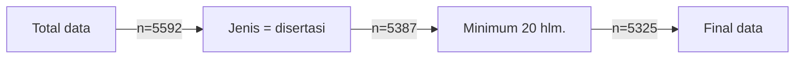

> Photo by [Charles DeLoye](https://unsplash.com/@charlesdeloye?utm_source=unsplash&utm_medium=referral&utm_content=creditCopyText) on [Unsplash](https://unsplash.com/photos/man-wearing-academic-gown-2RouMSg9Rnw?utm_source=unsplash&utm_medium=referral&utm_content=creditCopyText)

Awal tahun 2026 ini penulis berencana ingin melanjutkan studi doktoral😉 Tentunya ini bukanlah sesuatu yang sederhana dan perlu banyak persiapan yang matang, apalagi jika penulis ingin melanjutkan kuliah di luar negeri. Berbeda dengan S2 yang masih kental oleh kegiatan perkuliahan, program PhD lebih menekankan pada berfikir kritis, kreatif, manajemen waktu, dan menjadi peneliti yang independen.

Sebagai peneliti, tentunya kita perlu membuat publikasi, baik itu berupa jurnal, prosiding, maupun tesis/disertasi sebagai syarat kelulusan. Selama enam tahun terakhir penulis berkuliah S1 dan S2 di Indonesia, penulis sudah cukup familier dengan tradisi skripsi, tesis, artikel jurnal, serta prosiding.

Kemudian, apa bedanya dengan disertasi?



Yang penulis tahu disertasi biasanya lebih padat dibandingkan tesis dan mengandung lebih banyak landasan teoretis dari *systematic literature review*. Beberapa posting di Reddit yang pernah penulis baca juga menyebutkan bahwa disertasi bisa mencapai ratusan halaman, bahkan ada yang sampai 700 halaman😭

*Let's be real*, penulis agak minder untuk lanjut S3 karena penulis tidak tahu apakah penulis *good enough* untuk melanjutkan studi S3.

Sambil penulis membulatkan niat dan mencari calon supervisor, penulis mau cari tau, apakah bener kalau disertasi itu harus ratusan halaman?

[Kuper dan Fremlin (1972)](https://doi.org/10.1088/0031-9112/23/1/020) dalam buletin Physics menyebutkan bahwa kalau disertasi itu tidak perlu terlalu panjang, 70-80 halaman itu udah oke, tapi kalau bisa **50 halaman** lebih baik lagi😭 Setuju banget, Prof! Gak usah panjang-panjang isi disertasinya, yang penting substansinya😉

Nah, untuk menjawab pertanyaan penulis, kali ini penulis akan coba melakukan analisis panjang disertasi di kampus almamater S2 penulis, yaitu **IPB University**.

Seperti yang teman-teman tahu, sebagian besar universitas pasti memiliki layanan repositori daring yang bisa diakses oleh mahasiswa yang memiliki akun kampus sebagai pusat referensi untuk melakukan penelitian. Ketika saya dulu kuliah S2, saya sangat terbantu dengan adanya repositori ini karena saya bisa lihat bagaimana kakak tingkat saya menyusun laporan sehingga saya bisa lebih terarah dalam menyusun laporan.

Kebetulan sekali saya masih memiliki akun IPB yang dapat digunakan untuk mengakses [Repository IPB](https://repository.ipb.ac.id/) dan mengunduh naskah *full text*, sehingga penulis bisa melakukan analisis yang mendalam.

Pada artikel kali ini, penulis akan bahas hasil analisis data terlebih dahulu baru kemudian menjelaskan bagaimana proses pengolahan data tersebut menggunakan Python.

Yuk kita bahas!

## Statistik dan Tren Disertasi🎓

Statistik pertama yang akan kita lihat adalah tren publikasi disertasi per tahun, bulan, serta fakultas. Penulis ingin tahu secara umum bagaimana perkembangan tren publikasi serta fakultas apa saja yang paling produktif mencetak alumni bergelar doktor.

Per tanggal 26 Januari 2026, penulis berhasil mendapatkan total **5325** publikasi dari repositori IPB. Tahun 2010 merupakan tahun publikasi disertasi terbanyak IPB yang mencapai 1256 publikasi, wow! Penulis dulu lulus tahun 2025 dan ternyata sudah mencapai 294 publikasi dalam setahun.



Kalau kita lihat dari bulan lulus, ada banyak sekali publikasi di bulan Maret. Penulis sendiri melakukan publikasi di bulan Agustus, tepat di akhir jadwal KRS B. Secara umum, sepertinya tidak terdapat pola menarik dari waktu unggah publikasi ke repositori IPB.



Sekarang kalau kita bandingan banyaknya publikasi disertasi berdasarkan koleksi/fakultasnya, sebagian besar publikasi disertasi IPB itu masuk ke dalam kategori program multidisiplin. Peringkat kedua diduduki oleh agrikultur dan perikanan, IPB banget ya!



Penulis sendiri lulus dari Sekolah Sains Data, Matematika, dan Informatika (SSMI) dan sekolah ini baru didirikan sekitar tahun 2025, sehingga wajar sekali kalau jumlah publikasi disertasinya paling sedikit dibandingkan fakultas lain.

Oke deh, kita udah cukup tau tentang statistik publikasinya, sekarang waktunya menjawab *the grand question*:

## Jadi, Berapa Halaman?🫣

Rata-rata jumlah halaman disertasi di IPB adalah **173 halaman**. Estimasi yang lebih baik adalah nilai mediannya yaitu **161 halaman**. *Not bad, eh?*



Tentu ada banyak outlier pada data ini seperti yang terdapat pada histogram di atas. Pengen banget disertasi "hanya" 21 halaman, tapi lebih serem juga kalau disertasi sampai 702 halaman😭 Gak kebayang nulisnya gimana itu, salut untuk **Pak Marwan Rahman Yantu** dengan disertasinya yang berjudul "[Model Ekonomi Wilayah Komoditi Kakao Biji Propinsi Sulawesi Tengah](https://repository.ipb.ac.id/handle/123456789/49794)" sebagai disertasi terpanjang dengan total 702 halaman, beliau adalah lulusan Fakultas Ekonomi dan Manajemen tahun 2011.

Setahu penulis, kelompok humaniora dan bisnis biasanya memiliki naskah penelitian yang panjang karena sebagian besar isinya adalah teori. Berbeda dengan STEM yang biasanya lebih menekankan pada hasil eksperimen dan analisis sehingga panjang naskah laporan akhirnya *kadang* lebih pendek.

Ternyata asumsi ini juga bisa dikonfirmasi dari data, lo. Bisa kita lihat pada *box plot* di bawah ini bahwa fakultas Ekonomi dan Manajemen memiliki rata-rata disertasi terpanjang dibandingkan fakultas dan sekolah lain.



Jika kita tabulasi, kategori Kedokteran Hewan memiliki panjang disertasi paling pendek ($med=92, mean=104, sd=43$) dibandingkan fakultas lain, diikuti oleh SSMI ($med=112, mean=120, sd=31$) dan FMIPA ($med=117, mean=133, sd=57$).

> Tabel Statistik Deskriptif Banyaknya Halaman Disertasi berdasarkan Fakultas

| Fakultas                                           | median | mean  | std   | min   | max   |
|----------------------------------------------------|--------|-------|-------|-------|-------|
| Agriculture                                        | 144    | 156   | 57    | 25    | 549   |
| Agriculture Technology                             | 162    | 171   | 67    | 24    | 434   |
| Animal Science                                     | 124    | 132   | 51    | 36    | 388   |
| Business                                           | 162    | 174   | 66    | 29    | 680   |
| Economic and Management                            | 216    | 228   | 91    | 58    | 702   |
| Fisheries                                          | 160    | 172   | 74    | 23    | 565   |
| Forestry                                           | 160    | 168   | 64    | 51    | 523   |
| Human Ecology                                      | 192    | 198   | 70    | 35    | 519   |
| Mathematics and Natural Science                    | 117    | 133   | 57    | 26    | 372   |
| Multidiciplinary Program                           | 192    | 198   | 71    | 21    | 685   |
| School of Data Science, Mathematic and Informatics | 112    | 120   | 31    | 65    | 201   |
| Veterinary Science                                 | 92     | 104   | 43    | 44    | 269   |

*Phew!* Ternyata untuk ilmu komputer (SSMI/FMIPA) enggak terlalu ekstrem juga panjang naskah disertasinya. Setidaknya penulis jadi lebih tenang dan tentunya semakin *pede* untuk lanjut studi.

Oke deh, kita sudah dapat *insight* dari data, selanjutnya penulis akan *share* gimana cara membuat plot di atas.

## Technical Stuff🐍



Seperti biasa, penulis menggunakan bahasa pemrograman Python untuk melakukan *web scraping* dan analisis data. Pastikan kamu sudah menyiapkan *virtual environment* sendiri!

*Library* yang akan kita gunakan adalah `scrapy` untuk melakukan [*web scraping*](/post/web-scraping-dengan-scrapy/), Jupyter Notebook untuk ngoding, `pandas` dan `hvplot` untuk analisis data dan membuat visualisasi.

Kali ini penulis sedang bereksperimen menggunakan ekosistem visualisasi dari [HoloViz](https://holoviz.org/) sebagai alternatif dari Matplotlib karena *library* ini ternyata memiliki banyak fitur yang keren banget!

### Web Scraping Repository IPB🕷️

Buat temen-temen yang belum pernah membuat proyek *web scraping*, bisa juga ya cek artikel tentang [*web scraping* ini!](/post/web-scraping-dengan-scrapy/)

Kamu bisa lihat *Scrapy spider* yang penulis gunakan untuk *scraping* data dari IPB Repository di tautan berikut.

<iframe frameborder="0" scrolling="no" style="width:100%; height:331px;" allow="clipboard-write" src="https://emgithub.com/iframe.html?target=https%3A%2F%2Fgithub.com%2FKodesiana%2Fipb-repo-analysis%2Fblob%2Fd6de15857a4307ee695daef8fd17f97967682eab%2Funiv_repo%2Fspiders%2Fipb_spider.py%23L1-L12&style=default&type=code&showBorder=on&showLineNumbers=on&showFileMeta=on&showFullPath=on&showCopy=on"></iframe>

### Mengunduh Fulltext dengan Aria2📥

Setelah kamu punya data publikasi dari IPB Repository, selanjutnya kamu perlu mengunduh data *full text* dari repo IPB karena repo IPB tidak menyediakan informasi banyaknya halaman pada laman repo. Sayangnya, akses ke data *full text* ini hanya tersedia untuk mahasiswa dan alumni IPB. Kalau kamu bukan mahasiswa atau alumni, sayang sekali kamu belum bisa menjalankan proses *scraping*🥲

> Tapi tenang aja, penulis akan memberikan dataset yang sudah diproses sehingga kamu tidak perlu memiliki akun IPB

Selanjutnya, kita akan mengunduh dokumen *full text* dari repositori IPB. Untuk memudahkan proses pengunduhan, kita akan menggunakan *tool* [Aria2](https://aria2.github.io/). Aria2 adalah program untuk mengunduh berkas, mirip seperti `curl` dan `wget`. Penulis memilih Aria2 karena program ini mampu mengunduh data secara parallel dan bisa mengirimkan *cookie* sebagai bagian dari autentikasi ke server IPB.

```bash
aria2c --dir data/ipb_2026_files \
    --input-file=ipb_links.txt \
    --load-cookies=ipb-cookies.txt \
    -c \
    -j 8 \
    -x 1
```

### Analisis Data dengan Pandas🐼 dan Hvplot🌈



Sekarang saatnya kita sedikit membahas proses pengolahan dan analisis data. Untuk kode versi lengkap kamu dapat akses pada [Jupyter Notebook ini](https://github.com/Kodesiana/ipb-repo-analysis/blob/master/notebooks/stats-page-length.ipynb). Seperti biasa, kita perlu mengimpor *library* yang akan kita gunakan: `pandas`, `holoviews`, dan `hvplot`.

```python
from pathlib import Path
from urllib.parse import urlparse, unquote_plus

import pandas as pd
import holoviews as hv
import hvplot.pandas  # noqa
import hvplot
```

#### Data Loading

Sekarang kita perlu membaca 2 dataset, (1) metadata disertasi dan (2) metadata banyaknya halaman pada *full text*. Data kedua ini didapatkan menggunakan *script* [extract_pdf_length.py](https://github.com/Kodesiana/ipb-repo-analysis/blob/master/scripts/extract_pdf_length.py).

Data disertasi:

```python
df = pd.read_json("../data/ipb_2026/ipb_2026_disertasi.jsonl", lines=True)
df = df.drop(
    columns=[
        "date_issued",
        "keywords",
        "title",
        "abstract",
        "publisher",
        "language",
        "url",
    ]
)
df.head()
```

Contoh data:

|   | date_available       | type      | author                     | advisor                                           | attachments                                       | collections                                       |
|---|----------------------|-----------|----------------------------|---------------------------------------------------|---------------------------------------------------|---------------------------------------------------|
| 0 | 2026-01-20T15:36:41Z | Disertasi | [Anggraini, Rizqi Sari]    | [Harianto, Suroso, Arif Imam, Novianti, Tanti]    | [{'name': 'cover_H4603211010.pdf', 'size': '2.... | [{'name': 'DT - Economic and Management', 'url... |
| 1 | 2026-01-20T15:42:06Z | Disertasi | [Sulastri, Yeni]           | [Sunarti, Titi Candra, Sailah, Illah, Suryadar... | [{'name': 'cover_F3601211008_95d56e2c6af6 ...'... | [{'name': 'DT - Agriculture Technology', 'url'... |

Data banyaknya halaman:

```python
df_length = pd.read_json("../data/ipb_2026/disertasi_length.jsonl", lines=True)
df_length.head()
```

Contoh data:

|   | file_name             | pages | word_count | figures | drawings |
|---|-----------------------|-------|------------|---------|----------|
| 0 | 2005rab.pdf           | 174   | 0          | 174     | 0        |
| 1 | 2004ato.pdf           | 187   | 0          | 374     | 0        |
| 2 | 2005wrs.pdf           | 111   | 0          | 111     | 0        |
| 3 | 2015dhe.pdf           | 128   | 33834      | 172     | 1702     |
| 4 | K16190025_Roslina.pdf | 128   | 47373      | 170     | 1516     |

#### Data Wrangling

Selanjutnya kita perlu melakukan beberapa pemprosesan seperti melakukan normalisasi koleksi/fakultas, mencari nama berkas *full text*, dan menggabungkan data tersebut menjadi satu. Silakan cek [Jupypter Notebook](https://github.com/Kodesiana/ipb-repo-analysis/blob/master/notebooks/stats-page-length.ipynb) untuk melihat kode yang lengkap. Setelah kita mendapatkan data yang sudah digabungkan (`df_merged`), selanjutnya kita perlu menyaring data berdasarkan jenis publikasi dan jumlah halaman.

Ingat, proses *web scraping* tidak selalu reliabel untuk mengekstrak data terstruktur. Mungkin karena laman yang kita olah memiliki struktur yang tidak stabil atau *human error* yang menyebabkan data yang terdapat pada laman menjadi tidak reliabel.

```python
print(f"Total data: {df_merged.shape[0]}")

df_clean = df_merged[df_merged["type"] == "DISSERTATION"]
print(f"Is DISSERTATION: {df_clean.shape[0]}")

df_clean = df_clean[df_clean["pages"] > 20]
print(f"Has more than 20 pages: {df_clean.shape[0]}")
```

Kode di atas bertujuan untuk menyaring publikasi yang memiliki tipe **disertasi**, karena *surprise* meskipun penulis melakukan *scraping* pada koleksi disertasi, ada beberapa skripsi dan tesis yang masuk ke dalam koleksi tersebut. Salah satu contoh jelas dari *human error*.



Proses penyaringan dapat divisualisasikan seperti diagram alir di atas. Dataset awal mengandung 5.592 baris data dan setelah proses penyaringan, tersisa 5.325 data yang memenuhi kriteria.

#### Data Analysis

Oke, sekarang kita akan mulai membuat visualisasi!

Visualisasi pertama yang akan kita buat adalah jumlah publikasi disertasi per tahun dan bulan. Untuk membuat visualisasi ini sangat *straightforward* menggunakan fungsi `groupby` dan `hvplot`.

```python
jumlah_tahun_df = (
    df_clean.groupby(df_clean["date_available"].dt.year)
    .size()
    .sort_index()
    .reset_index()
    .rename(columns={0: "count"})
)

jumlah_tahun_df["date_available"] = jumlah_tahun_df["date_available"].astype(str)
jumlah_tahun_df.hvplot.bar(x="date_available", c="count", cmap="bokeh", robust=True)
```

Selanjutnya kita akan membuat visualisasi jumlah publikasi disertasi per bulan. Konsep yang digunakan sama seperti pada visualisasi per tahun, tetapi sekarang kita mengelompokkan data berdasarkan bulan. Selain itu, kita juga perlu melakukan pemetaan nama bulan agar visualisasi menjadi lebih menarik.

```python
MONTHS = {
    i + 1: k
    for i, k in enumerate(
        [
            "Januari",
            "Februari",
            "Maret",
            "April",
            "Mei",
            "Juni",
            "Juli",
            "Agustus",
            "September",
            "Oktober",
            "November",
            "Desember",
        ]
    )
}

jumlah_bulan_df = (
    df_clean.groupby(df_clean["date_available"].dt.month)
    .size()
    .sort_index()
    .reset_index()
    .rename(columns={0: "count"})
)

jumlah_bulan_df["date_available"] = jumlah_bulan_df["date_available"].map(MONTHS)
jumlah_bulan_df.hvplot.bar(x="date_available", c="count", cmap="bokeh", robust=True)
```

Selain tren jumlah publikasi per tahun dan bulan, kita bisa lihat produktivitas publikasi disertasi berdasarkan fakultas/sekolah. Visualisasi ini bisa juga menjadi indikator popularitas fakultas/sekolah.

```python
jumlah_fakultas_df = df_clean["faculty"].value_counts().reset_index()
jumlah_fakultas_df.hvplot.barh(x="faculty", c="count", cmap="bokeh", robust=True)
```

Sudah cukup informatif ya mengenai produktivitas publikasi disertasi berdasarkan waktu dan fakultas/sekolah, saatnya kita menjawab pertanyaan utama: **berapa rata-rata banyaknya halaman disertasi?**

Kita bisa menggunakan visualisasi berupa histogram untuk melihat sebaran jumlah halaman disertasi.

```python
stats_text = f"""
med = {df_clean["pages"].median():.0f}
mean = {df_clean["pages"].mean():.0f}
sd = {df_clean["pages"].std():.0f}
max = {df_clean["pages"].max()}
min = {df_clean["pages"].min()}
"""

df_clean["pages"].hvplot.hist(bins=100, c="pages", cmap="bokeh", robust=True) * hv.Text(500, 200, stats_text)
```

Ternyata, secara umum disertasi di IPB memiliki rata-rata 174 halaman! Lumayan banyak ya? Untuk membuat visualisasi yang lebih informatif, kita bisa mengelompokkan data jumlah halaman tadi berdasarkan fakultas/sekolah dan kemudian disajikan sebagai *box plot*.

```python
df_clean.hvplot.box(y="pages", by="faculty", invert=True, c="pages", cmap="bokeh", robust=True)
```

Akhirnya, kita bisa menampilkan statistik untuk setiap fakultas/sekolah menggunakan fungsi `pivot_table`.

```python
df_clean.pivot_table(index="faculty", values="pages", aggfunc=["median", "mean", "std", "min", "max"]).astype(int)
```

Silakan cek kembali penjelasan sebelumnya untuk mengetahui visualisasi-visualisasi yang dihasilkan oleh kode-kode di atas!

## Penutup🎓

Menarik sekali ya, satu sumber data ternyata bisa diolah menjadi banyak *insight*. Semoga artikel kali ini bisa menjadi inspirasi untuk temen-temen yang sedang belajar *data analysis* atau bahkan sedang bingung apakah mau lanjut studi S2/S3.

*Eitss*, artikel ini engga selesai sampai di sini ya! Penulis punya satu proyek lain yang menggunakan dataset ini yang targetnya adalah membantu temen-temen yang berencana kuliah di IPB untuk mencari calon dosen pembimbing (S2) atau promotor (S3).

*Stay tuned* ya temen-temen untuk artikel selanjutnya!

## Referensi📚

1. Kuper, C G, and J H Fremlin. “Length of PhD Theses.” Physics Bulletin 23, no. 1 (1972): 45–46. https://doi.org/10.1088/0031-9112/23/1/020.
2. beckmw. “How Long Is the Average Dissertation?” R Is My Friend, April 15, 2013. https://beckmw.wordpress.com/2013/04/15/how-long-is-the-average-dissertation/.
