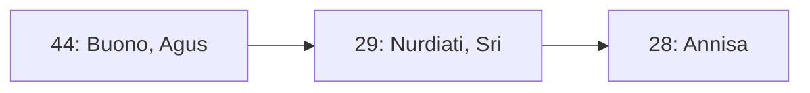
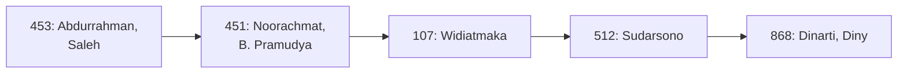

> Photo by [UX Indonesia](https://unsplash.com/@uxindo?utm_source=unsplash&utm_medium=referral&utm_content=creditCopyText) on [Unsplash](https://unsplash.com/photos/person-writing-on-white-paper-qC2n6RQU4Vw?utm_source=unsplash&utm_medium=referral&utm_content=creditCopyText)
>
> Baca bagian pertama: [Berapa Rata-Rata Panjangnya Disertasi?📘](/post/berapa-rata-rata-panjangnya-disertasi/)

Halo teman-teman, balik lagi nih di lanjutan seri artikel mengenai *web scraping* data repositori IPB. Pada [artikel sebelumnya](/post/berapa-rata-rata-panjangnya-disertasi/), kita sudah mengumpulkan data berupa judul publikasi, penulis, hingga nama-nama dosen pembimbing. Proyek sebelumnya fokus untuk menjawab pertanyaan "berapa rata-rata panjangnya disertasi?" Akan tetapi, kita punya lebih banyak data yang bisa kita olah lebih lanjut untuk menjawab pertanyaan-pertanyaan lain.

Pada proyek kali ini, kita akan memanfaatkan data yang sudah dikumpulkan pada artikel sebelumnya untuk menjawab pertanyaan baru:

> Kalau saya ingin lanjut kuliah S3, siapa promotor yang penelitiannya sejalan dengan minat saya?

Hal ini menjadi penting karena untuk melanjutkan studi S3, prosedurnya agak berbeda dengan S2. Kita harus mencari dosen promotor terlebih dahulu, memastikan bahwa kita memiliki ide/proposal penelitian yang sejalan dengan dosen tersebut, barulah kita bisa melakukan pendaftaran ke kampus tujuan.

Nah buat temen-temen yang mau masuk IPB, baik itu S1/S2 maupun S3, kamu pasti akan sangat terbantu nantinya tidak hanya untuk mencari calon promotor, tetapi juga mencari calon dosen pembimbing. Kira-kira siapa saja dosen yang memiliki topik penelitian yang sejalan dengan minat kalian? Yuk kita cari tahu!

## Aplikasi Visualisasi Co-authorship IPB🎓



Buat kamu yang mau langsung cari nama dosen tujuan, kamu bisa langsung cek aplikasi yang penulis buat: **IPB Supervisor Research Network App**. Aplikasi ini dibuat berdasarkan metode yang akan dibahas di artikel ini, jadi kamu gak perlu khawatir masalah validitas data. Kamu juga bisa latihan membuat visualisasi seperti aplikasi ini dengan mengikuti tutorial di artikel ini😉

## Teori Graf (*Graph Theory*)🕸️

Sebelum kita mulai membangun dan menganalisis data ini, sebaiknya kita sedikit berkenalan dulu dengan teori graf atau *graph theory*. Penulis tidak akan membahas secara mendalam mengenai teori graf tapi cukup sebagai pengantar agar kita bisa memahami apa yang akan kita lakukan di proyek kali ini.

Penulis memilih untuk menggunakan pendekatan graf pada proyek kali ini karena sifat data dan target *insight* yang kita inginkan dari data. Coba kita ingat-ingat lagi, ketika melakukan penelitian, dosen pasti tidak sendiri, apalagi untuk mahasiswa S3. Sering kali kita melihat dosen punya kelompok penelitian kecil atau *bestie*, kamu pasti pernah mengamati fenomena ini.

Dosen A biasanya punya mahasiswa bimbingan dengan dosen B. Atau Dosen C biasanya membimbing topik *data mining* dan dosen B juga pakar di topik yang sama. Artinya, dosen A, B, dan C ini bisa jadi memiliki kepakaran yang sama, teman dekat, atau peneliti multidisiplin. Sebagai mahasiswa, kamu mungkin perlu alternatif beberapa dosen pembimbing/promotor, nah dengan mengikuti jaringan peneliti ini, kita bisa melakukan *profiling* dosen dengan lebih mudah sebagai sebuah jaringan atau graf (*graph*). Bagi teman-teman yang pernah melakukan penelitian bibliometrik, teman-teman pasti sudah tidak asing lagi dengan istilah *co-authorsip*😎

Jadi, apa itu graf?

> **Definition 1**. A graph $G=(V,E)$ consists of a set $V$ of **vertices** (also called **nodes**) and a set of $E$ of *edges*.
>
> Sumber: [GRAPH THEORY: BASIC DEFINITIONS AND THEOREMS](https://math.gordon.edu/courses/mat230/handouts/graphs.pdf)

Dengan kata lain, suatu graf $G$ terdiri atas satu atau lebih $V$ *vertex* atau *node* yang dihubungkan oleh satu atau lebih *edge*. Kalau kita pakai analogi dosen di atas, **dosen** adalah **vertex/node** dan keduanya saling terhubung/berelasi (**edge**) karena pernah membimbing mahasiswa yang sama.

Contoh lain yang sering kita temukan di kehidupan sehari-hari adalah jaringan jalan raya. Berangkat dari rumah, lewat jalan kecil menuju jalan raya, kemudian belok 2 kali sampai lokasi kafe hehe. Nah, artinya jalan raya juga dapat direpresentasikan sebagai jaringan/graf. Salah satu karakteristik yang bisa kita amati dari jalan raya adalah banyaknya persimpangan. Ada jalan dengan 3 atau bahkan 4 persimpangan.

Dalam konteks teori graf, banyaknya *persimpangan jalan* disebut sebagai **degree** atau derajat suatu *node*. Derajat suatu *node* sering kali digunakan untuk menentukan apakah *node* tersebut populer atau merupakan sentral/pusat. Ini disebut juga sebagai *centrality*. Contoh lain dalam media sosial adalah jumlah *follower*, orang yang memiliki banyak *follower* bisa kita anggap sebagai suatu pusat, karena orang tersebut memiliki banyak relasi dengan orang lain (*node* lain).

Kembali lagi ke analogi jalan raya, ketika kita ingin pergi ke suatu tempat, kita pasti ingin cepat sampai ke lokasi dan biasanya, untuk mencapai lokasi paling cepat kita perlu mencari jalan terpendek. *Shortest path* merupakan salah satu metode dalam teori graf untuk menemukan jarak terpendek dari dua *node*. Terdapat dua algoritma yang populer untuk menemukan jarak terdekat: [Algoritma Djikstra dan A*](https://web.stanford.edu/class/archive/cs/cs106b/cs106b.1262/lectures/27-dijkstra/). Tanpa kita sadari, setiap kali kita membuka Google Maps, algoritma ini yang bertanggung jawab untuk menemukan rute tercepat antara dua lokasi.

Oke, sampai di sini kita sudah belajar beberapa istilah: **vertex/node, edge, degree, centrality,** dan **shortest path**. Kita akan menerapkan metode-metode ini pada pembahasan selanjutnya. Tenang aja, penulis akan menjelaskan juga mengenai alasan dan tujuan penggunaan metode-metode di atas. Yuk kita mulai!

## Membangun Graf dengan NetworkX🗼






Seperti biasa, teman-teman bisa akses kode dan dataset yang akan kita gunakan pada proyek ini dengan klik tombol di atas. Silakan persiapkan *virtual environment* Python yang baru sebelum kita mulai. *Install library* `pandas`, `networkx`, dan `hvplot`. Ketiga *library* ini adalah pondasi kita untuk melakukan analisis.

Oke, tahap pertama adalah mengimpor library:

```python
import json
import itertools
from collections import Counter

import pandas as pd
import networkx as nx
import hvplot.networkx as hvnx
```

### Memuat Data📥

... kemudian kita baca dataset menggunakan `pandas`.

```python
df = pd.read_json("../data/ipb_2026_disertasi.jsonl", lines=True)
df = df.drop(columns=["date_issued", "author", "abstract", "publisher", "language"])

df.head(2)
```

Contoh output:

|   | date_available       | type      | title                                             | keywords                                          | advisor                                           | collections                                       |
|---|----------------------|-----------|---------------------------------------------------|---------------------------------------------------|---------------------------------------------------|---------------------------------------------------|
| 0 | 2026-01-20T15:36:41Z | Disertasi | Risiko dan Perilaku Ekonomi Rumah Tangga Petan... | [ekonomi rumah tangga, id, kelapa sawit swaday... | [Harianto, Suroso, Arif Imam, Novianti, Tanti]    | [{'name': 'DT - Economic and Management', 'url... |
| 1 | 2026-01-20T15:42:06Z | Disertasi | Desain Proses Pemurnian Glukomanan dari Umbi P... | [glukomanan, id, kavitasi hidrodinamik, id, ka... | [Sunarti, Titi Candra, Sailah, Illah, Suryadar... | [{'name': 'DT - Agriculture Technology', 'url'... |

### Praproses Data🧹

Selanjutnya kita akan mulai melakukan *data cleaning*. Beberapa hal yang bisa kita lihat pada output di atas yaitu:

1. `keywords` dan `advisor` memiliki tipe data `list[str]` yang tentunya normal karena satu publikasi pasti memiliki lebih dari satu kata kunci dan dibimbing oleh lebih dari satu dosen
2. `collections` berisi `list[dict]` yang berisi nama koleksi (dalam konteks ini nama fakultas/sekolah) dan URL ke koleksi tersebut

Kita perlu melakukan normalisasi data pada kolom `collections` untuk mendapatkan nama fakultasnya saja dari dalam `list`. Fungsi `json_normalize` dapat membantu kita untuk mengubah `dict` menjadi `DataFrame`.

```python
df_faculty = pd.json_normalize(df["collections"].str[0]).add_prefix("collection_")
df_faculty.head()
```

Contoh output:

|   | collection_name              | collection_url          |
|---|------------------------------|-------------------------|
| 0 | DT - Economic and Management | /handle/123456789/85    |
| 1 | DT - Agriculture Technology  | /handle/123456789/83    |
| 2 | DT - Human Ecology           | /handle/123456789/88    |
| 3 | DT - Business                | /handle/123456789/78145 |
| 4 | DT - Economic and Management | /handle/123456789/85    |

Sekarang kita bisa menggabungkan `df_faculty` dengan `df` untuk membuat data yang lengkap. Selain itu, kita akan melakukan beberapa praproses data lain:

1. Baris 1. Menggabungkan `df` dan `df_faculty` berdasarkan indeks
2. Baris 3. Menghapus 5 karakter awal dari kolom `colection_name` untuk menghilangkan prefiks "DT - "
3. Baris 4-8. Normalisasi tipe publikasi, ada beberapa jenis publikasi yang sama-sama disertasi tetapi memiliki variasi nama.
4. Baris 10-12. Mengubah *keyword* menjadi huruf kecil dan menghapus *keyword* "id"
5. Baris 14. Menyaring data yang memiliki tipe DISSERTATION
6. Baris 15-22. Menghapus kolom yang tidak digunakan

```python
df_merged = df.join(df_faculty)

df_merged["faculty"] = df_merged["collection_name"].str[5:]
df_merged["type"] = (
    df_merged["type"]
    .str.upper()
    .replace(["DISERTASI", "DISERTATION", "DISSERTATIONS"], "DISSERTATION")
)

df_merged["keywords"] = df_merged["keywords"].apply(
    lambda x: [v.lower() for v in x if v != "id"]
)

df_merged = df_merged[df_merged["type"] == "DISSERTATION"]
df_merged = df_merged.drop(
    columns=[
        "date_available",
        "collections",
        "collection_name",
        "collection_url",
    ]
)

df_merged.head(2)
```

Contoh output:

|   | type         | title                                                 | keywords                                          | advisor                                           | year | faculty                 |
|---|--------------|-------------------------------------------------------|---------------------------------------------------|---------------------------------------------------|------|-------------------------|
| 0 | DISSERTATION | Risiko dan Perilaku Ekonomi Rumah Tangga Petan...     | [ekonomi rumah tangga, kelapa sawit swadaya, f... | [Harianto, Suroso, Arif Imam, Novianti, Tanti]    | 2026 | Economic and Management |
| 1 | DISSERTATION | Desain Proses Pemurnian Glukomanan dari Umbi P...     | [glukomanan, kavitasi hidrodinamik, kalsium ok... | [Sunarti, Titi Candra, Sailah, Illah, Suryadar... | 2026 | Agriculture Technology  |

Sip! Sekarang data yang kita punya sudah rapi dan siap untuk ditransformasi menjadi sebuah graf.

### Membuat Graf dengan NetworkX🕸️

Tahap pertama untuk membuat graf adalah melakukan iterasi pada semua publikasi, kemudian menambahkan *nodes* dan *edges* pada graf. Jenis graf yang akan kita buat adalah **undirected graph**. Graf ini disebut juga graf tidak berarah.

```python
G_all = nx.Graph()
for i, row in df.iterrows():
    for author in itertools.combinations(row["advisor"], 2):
        if author[0] is None or author[1] is None:
            continue

        if G_all.has_edge(author[0], author[1]):
            G_all[author[0]][author[1]]["weight"] += 1
        else:
            G_all.add_edge(author[0], author[1], weight=1)
```

`df.iterrows()` sesuai namanya berfungsi untuk menghasilkan `Generator` yang mengembalikan indeks baris dan data pada baris tersebut. Selanjutnya fungsi `itertools.combinations` akan menghasilkan kombinasi dari nama-nama pembimbing. Masih ingat konsep kombinatorika matematika? Misal ada 3 pembimbing, kita akan ambil kombinasi 2 pembimbing, berarti terdapat $\binom{4}{2} = 6$ kombinasi pembimbing.

Fungsi `has_edge` mengecek apakah sudah terdapat *edge* atau relasi antara dosen 1 dan dosen 2, jika ada, maka kita akan menambah nilai atribut `weight` pada *edge* tersebut. Atribut `weight` menunjukkan berapa kali kombinasi dosen tersebut pernah berkolaborasi dalam publikasi yang sama. Jika *edge* belum ada pada graf, maka kita akan menambahkan *edge* sekaligus *nodes* dengan memanggil fungsi `add_edge`.

Sebelum kita lanjut melakukan analisis, kita perlu memeriksa apakah graf yang dibuat saling terhubung atau apakah terdapat graf yang terisolasi dari graf lain. Ini penting karena analisis yang akan kita lakukan berasumsi bahwa kita hanya mengolah data untuk satu graf yang saling terhubung.

```python
n_components = list(len(x) for x in nx.connected_components(G_all))
print(n_components)

# Output:
# [3525, 3, 2, 3, 2, 3, 2, 2, 2, 11, 4, 2, 5, 9, 5, 4, 4, 3, 7, 4, 4, 4, 2, 3, 2, 3, 3, 2, 3, 6, 3, 3, 3, 2, 2, 6, 2, 3, 3, 3, 3, 3, 3, 2, 2]
```

Output di atas menunjukkan bahwa ada satu graf yang saling terhubung dan terdiri atas 3525 *nodes* dan ada banyak sub-graf lain yang hanya memiliki 2-11 *nodes*. Untuk memudahkan analisis, kita hanya akan menggunakan graf dengan jumlah *nodes* terbanyak.

```python
largest_cc_nodes = max(nx.connected_components(G_all), key=len)
G_largest = G_all.subgraph(largest_cc_nodes).copy()
G_largest = nx.convert_node_labels_to_integers(G_largest, label_attribute="name")
```

`G_largest` berisi graf dengan jumlah *nodes* terbanyak dan graf ini yang akan kita gunakan untuk analisis selanjutnya. Kamu juga bisa menyimpan graf ini dalam format *GraphML* untuk analisis terpisah nantinya menggunakan aplikasi Cytoscape: `nx.write_graphml(G_largest, "ipb.graphml")`

Kamu bisa unduh data graf ini dalam format GraphML dengan klik tombol berikut.



Sekarang kita sudah bisa melakukan visualisasi data. Tetapi, kita tidak bisa langsung memvisualisasikan graf `G_largest` karena graf kita memiliki 3.525 *nodes* dan 13.971 *edges*. Program Python kita pasti akan *crash* jika kita memvisualisasikan semua data sekaligus. Maka dari itu, kita bisa ambil subgraf dari keseluruhan graf, misal *node* 44 beserta tetangganya:

```python
G_vis = G_largest.subgraph([44] + list(G_largest.neighbors(44)))
hvnx.draw(G_vis, with_labels=True)
```

Contoh output:



Graf di atas menunjukkan jaringan untuk *node* 44 (Prof Agus Buono, dekan SSMI) beserta tetangga langsungnya. Dari satu graf kecil ini kita bisa lihat bahwa jaringan peneliti Prof Agus Buono sangat luas dan dosen-dosen kolaboratornya juga saling berkolaborasi dan membentuk jaringan sendiri. Keren ya?

Kamu bisa coba untuk memvisualisasikan *node* lain dengan mengganti nilai 44 dengan nilai lain seperti yang terdapat pada `G_largest.nodes`

## Analisis Jaringan (*Network Analysis*)🔬

Graf sudah dibuat, sekarang waktunya kita melakukan analisis karakteristik graf. Kita akan melakukan dua analisis utama: kesentralan (*centrality*) dan jalur terpendek (*shortest path*).

### Kesentralan (*Centrality*)📍

Analisis pertama yang akan kita lakukan adalah menghitung ukuran kesentralan atau *centrality*. Ukuran kesentralan ini bertujuan untuk memberikan **peringkat/*ranking*** pada setiap *node* dengan mempertimbangkan lokasinya di dalam graf. Dengan kata lain, kita ingin mengetahui *node* mana yang "penting" atau "pusat" sebuah graf. Dalam konteks *co-authorship*, kita ingin tau siapa peneliti dengan kolaborator terbanyak.

Terdapat beberapa jenis ukuran kesentralan, pada proyek ini kita akan menggunakan tiga ukuran klasik (*degree centrality, betweenness centrality*, dan *eigenvector centrality*). Selain itu, kita juga akan menggunakan algoritma [PageRank](https://mti.binus.ac.id/2021/12/31/algoritma-pagerank/). Algoritma PageRank pertama kali dikemukanan oleh Larry Page dan Sergey Brin pada tahun 1996 di Standford University. Algoritma inilah yang menjadi kunci Google untuk menghasilkan hasil pencarian yang sangat relevan (dulu, sekarang AI semua😭).

```python
stats_degree = nx.degree_centrality(G_largest)
stats_betweenness = nx.betweenness_centrality(G_largest)
stats_eigenvector = nx.eigenvector_centrality(G_largest)
stats_pagerank = nx.pagerank(G_largest, alpha=0.9)

df_analysis = pd.DataFrame({
    "node_id": stats_pagerank.keys(),
    "degree": stats_degree.values(),
    "betweenness": stats_betweenness.values(),
    "eigenvector": stats_eigenvector.values(),
    "pagerank": stats_pagerank.values(),
})

df_analysis.sort_values("degree", ascending=False).head()
```

Contoh output:

|     | node_id | degree   | betweenness | eigenvector | pagerank |
|-----|---------|----------|-------------|-------------|----------|
| 58  | 58      | 0.035471 | 0.033010    | 0.168916    | 0.005611 |
| 184 | 184     | 0.034904 | 0.051924    | 0.146368    | 0.004153 |
| 39  | 39      | 0.032633 | 0.035424    | 0.175073    | 0.004028 |
| 24  | 24      | 0.032350 | 0.034613    | 0.172723    | 0.005001 |
| 512 | 512     | 0.030079 | 0.032690    | 0.066152    | 0.004103 |

Tabel di atas menunjukkan lima peneliti "paling berdampak" di IPB karena mereka memiliki jaringan kolaborator yang paling luas. Node 58 adalah Prof Hermanto Siregar, dosen Departemen Ekonomi IPB sekaligus wakil rektor IPB. Nilai *degree* menunjukkan berapa banyak *edge* yang terhubung dengan *node*. Semakin besar *degree*, berarti semakin banyak *node* yang terhubung dengan *node* tersebut.

Nilai *betweenness* dihitung berdasarkan berapa banyak *node* tersebut menjadi bagian dari suatu *short path*. Interpretasinya adalah semakin besar nilai *betweenness*, berarti *node* tersebut *penting* karena dia adalah jembatan yang menghubungkan dua *node*. Bagaikan jembatan gantung yang menyambungkan dua desa, jika jalan ini terputus, maka banyak warga (*nodes*) yang berada dikedua belah ruas jalan tidak bisa saling terhubung lagi.

Kalau *Eigenvector* gimana? Definisi *eigenvector centrality* sedikit lebih *math-y*, sehingga penulis akan memberikan interpretasi sendiri. Penulis memahami konsep *eigenvector centrality* sebagai ukuran *prestige* suatu *node* berdasarkan tetangga/lingkungannya. Sebuah *node* dianggap penting atau memiliki nilai *eigenvector* yang tinggi apabila *node* tersebut terhubung dengan *node* lain yang sama-sama penting. Jika pada *betweenness centrality* suatu *node* dianggap penting karena sering dilalui *shortest path*, pada *eigenvector centrality* suatu *node* dianggap penting apabila *node* tersebut sering terhubung dengan *node* penting lain.

> Masih bingung dengan *eigenvector?* The explanation is trivial and left as an exercise to the reader🐼 Penulis menyarankan kalian untuk coba cari referensi dari buku. Saat ini penulis belum bisa memberikan penjelasan yang mudah dipahami karena penulis belum 100% paham juga😭

Terakhir, penjelasan mengenai PageRank akan penulis serahkan melalui video berikut. Konsep dibalik PageRank sendiri lumayan kompleks, tetapi video berikut dapat menyajikan penjelasan yang mudah dipahami. Video ini juga menjelaskan konsep-konsep yang berkaitan dengan PageRank seperti rantai Markov (*Markov chain*) yang merupakan salah satu bagian penting dari PageRank. Intinya, PageRank menilai sebuah *node* adalah *baik* apabila *node* tersebut memiliki banyak *in degree* atau *edge* yang mengarah masuk ke *node* tersebut. Karena graf yang kita buat adalah graf tidak berarah (*undirected graph*), `networkx` akan mengubah graf tersebut menjadi graf berarah (*directed graph*) dengan dua arah *edge* (masuk/keluar).



### Jalur Terpendek (*Shortest Path*)🗺️

Eksperimen terakhir yang akan kita lakukan berkaitan dengan *shortest path*. Seperti yang sudah kita bahas sebelumnya, *shortest path* memiliki banyak aplikasi, salah satunya adalah pencarian rute terdekat antara dua lokasi.

Dalam konteks *co-authorship*, kita bisa mengukur rata-rata *shortest path* dalam graf. Rata-rata *shortest path* ini dapat menggambarkan seberapa eratnya komunitas/kolaborasi peneliti. Rata-rata jarak terpendek pada graf ini (`nx.average_shortest_path_length(G_largest)`) adalah 3,9904 ≈ 4 yang artinya kolaborasi antar peneliti dapat terjadi dengan cepat, kolaborasi antara peneliti A dan B yang mungkin belum pernah berkolaborasi sama sekali, bisa terjadi dengan kolaborasi dengan setidaknya 4 orang peneliti. Fenomena ini disebut juga sebagai *small-world structure* [(Newman, 2004)](https://pmc.ncbi.nlm.nih.gov/articles/PMC387296).

Selanjutnya, kita bisa mencoba untuk mencari jalur terpendek antara dua peneliti sebagai berikut. Contohnya kita akan mencari jarak terpendek antara *node* 453 menuju *node* 868.

```python
shortest_nodes = nx.shortest_path(G_largest, source=453, target=868)
print(" --> ".join([f"{node_id}: {G_largest.nodes[node_id]['name']}" for node_id in shortest_nodes]))
```

Kode di atas menghasilkan diagram alir sebagai berikut.



Berikut adalah jarak terdekat untuk *node* 453 &rarr; 512.



Bayangkan kamu sekarang mencari dosen pembimbing kedua atau Anda ingin menghubungi dosen tertentu tapi gak tau mau minta referensi ke dosen mana. Pendekatan jarak terpendek ini bisa menunjukkan relasi peneliti yang kamu butuhkan untuk menghubungi dosen tujuan.

## Penutup🐼

Wow, cukup banyak hal yang sudah kita bahas di artikel ini. Kita sudah berkenalan dengan teori graf, cara membuat graf, hingga melakukan beberapa analisis yang umum dilakukan pada sebuah graf. Ingat, masih banyak topik yang belum kita bahas: deteksi komunitas, graf *bipartite*, siklus Hamilton, *directed/undirected graph*, *cyclic/acyclic graph*, dll.

Semoga artikel kali ini bisa menjadi inspirasi teman-teman untuk melakukan penelitian atau proyek yang menggunakan pendekatan teori graf. Metode ini sangat *versatile* dan jika diterapkan dengan tepat, dapat menghasilkan *insight* yang berdampak. Apalagi di era AI seperti sekarang, metode *Agentic RAG* mulai mengadopsi basis data graf sebagai *knowledge graph* yang menghubungkan fakta-fakta dari dokumen tidak terstruktur.

Sampai ketemu di artikel selanjutnya!

## Referensi

1. Gordon College. “MAT230 Lecture Notes.” Fall 2019. https://math.gordon.edu/courses/mat230/notes.html.
2. Newman, M. E. J. “Coauthorship Networks and Patterns of Scientific Collaboration.” Proceedings of the National Academy of Sciences of the United States of America 101, no. Suppl 1 (2004): 5200–5205. https://doi.org/10.1073/pnas.0307545100.
