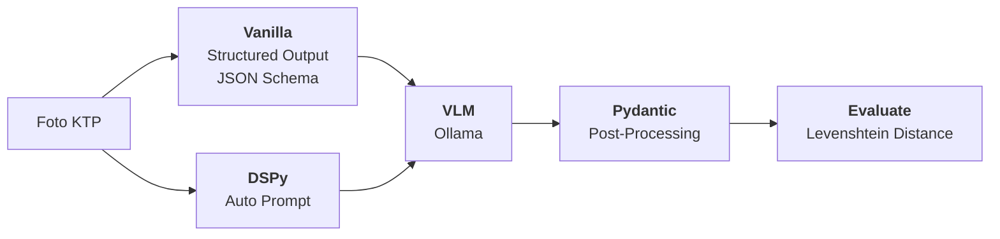

> Photo by [CardMapr.nl](https://unsplash.com/@cardmapr?utm_source=unsplash&utm_medium=referral&utm_content=creditCopyText) on [Unsplash](https://unsplash.com/photos/a-passport-and-a-boarding-pass-are-on-a-bag-LVA3S6isNYQ?utm_source=unsplash&utm_medium=referral&utm_content=creditCopyText)

Halo teman-teman, apa kabar nih? Semoga dalam kondisi sehat ya!

Tahun 2026 ini siapa sih orang *tech* yang enggak tau *Gen AI/Large Language Models (LLM)?* Pasti teman-teman semua sudah pernah menjajal layanan seperti Open AI ChatGPT, Google Gemini, atau Anthropic Claude. Entah itu untuk ngobrol ringan atau untuk membantu pekerjaan melalui automasi (n8n, OpenClaw, dll.) dan asisten koding (Claude Code, Codex, dll.). Seperti yang teman-teman tau, sekarang ini LLM sudah sangat berkembang pesat, yang awalnya hanya bisa mengolah teks sekarang model LLM sudah mampu mengolah data multimodal (gambar, audio, dan video).

Teman-teman mungkin pernah ikut tren seperti membuat foto dengan gaya Studio Ghibli, identifikasi apakah suatu foto itu asli atau palsu, atau bahkan mencari alamat dari suatu foto. Nah model-model AI yang mampu mengolah data gambar ini disebut juga [Vision Language Model (VLM)](https://huggingface.co/blog/vlms). Kemampuannya untuk dapat memahami konten suatu gambar menjadikan VLM sangat strategis untuk proses ekstraksi informasi, salah satunya untuk melakukan *Optical Character Recognition (OCR)*.

Pada artikel kali ini kita akan coba mengaplikasikan model-model VLM untuk mengekstrak data KTP menjadi JSON. Yuk kita coba pelajari lebih lanjut.

> Penulis berasumsi teman-teman sudah punya pengalaman menggunakan dengan LLM dan VLM seperti ChatGPT atau Gemini. Teman-teman bisa belajar dasar-dasar [VLM di sini](https://huggingface.co/blog/vlms).

## VLM, DSPy, dan *Prompt Engineering*🤖



Sedikit *refresher*: *Prompt engineering* adalah teknik membuat input sedemikian rupa untuk mengatur analisis, nada, gaya bahasa, hingga struktur output sebuah LLM/VLM. Ada banyak sekali metode *prompt engineering*:

1. *zero shot*,
2. *few shot*,
3. *chain of thought*,
4. *tree of thought*, dan lain sebagainya.

Kamu pasti tau rasanya ketika bertanya sesuai ke AI dan jawabannya *kurang oke*, akhirnya kamu terus memberikan perintah baru supaya hasilnya sesuai harapan. Atau kamu mungkin pernah menggunakan *template chat* dari internet, format *prompt*-nya sudah disiapkan dan cukup mengisi beberapa informasi pelengkap saja dan tiba-tiba LLM tersebut bisa menjawab pertanyaan kamu dengan sempurna. Inilah kekuatan dari *prompt engineering*.

*Prompt engineering* memang ada seninya dan sering kali untuk membuat *prompt* yang dapat menghasilkan output yang bagus itu sulit.

Tetapi apakah kamu tau ada *library* yang bisa menjadi alternatif supaya kita tidak perlu membuat *prompt* sendiri? Kenalin [DSPy](https://dspy.ai/).

> Instead of wrangling prompts or training jobs, DSPy (Declarative Self-improving Python) enables you to build AI software from natural-language modules and to generically compose them with different models, inference strategies, or learning algorithms. This makes AI software more reliable, maintainable, and portable across models and strategies. (Sumber: DSPy)

Singkat kata, DSPy membantu kita untuk **tidak perlu membuat prompt, tetapi kita memprogram AI melalui komposisi modul-modul**. Contoh:

*Zero-shot prompting:*

```python
response = client.chat(
    model="gemma4:e4b",
    messages=[
        {
            "role": "user",
            "content": "You are a content moderator designed classify positive and negative text sentiment.\nReply NEGATIVE or POSITIVE only.\nText: this place sucks",
        },
    ],
)

print(response.message.content)
> NEGATIVE
```

*DSPy:*

```python
sentence = "this place sucks" 
classify = dspy.Predict('sentence -> sentiment: bool')
response = classify(sentence=sentence)

print(response.sentiment)
> False
```

Keren ya? Kita tidak perlu lagi memberi tahu secara spesifik bagaimana model AI perlu merespon karena proses tersebut dilakukan oleh DSPy. Tentunya DSPy juga tidak serta-merta langsung menghasilkan *prompting* yang bagus. Kita juga perlu *training* modul DSPy supaya dia bisa menghasilkan output yang kita mau.

> Pada artikel ini penulis tidak akan membahas mengenai metode optimasi menggunakan DSPy

Yuk sekarang kita coba lihat bagaimana pengaplikasikan VLM dan DSPy untuk mengekstrak informasi dari foto KTP.

## *Environment Setup*🖥️

Oke, sebelum kita mulai mengolah data, kita perlu akses ke API model LLM/VLM. Pada artikel ini penulis menggunakan *tool* [Ollama](https://ollama.com/) dan GPU MSI Nvidia RTX 3060 12 GB untuk bekerja dengan VLM. Kamu bisa menggunakan Docker dan `compose.yml` yang terdapat pada repositori kode ini untuk menjalankan server baru.

Selanjutnya kita perlu memilih model apa yang akan kita gunakan. Kita blisa lihat dari laman [Ollama Models](https://ollama.com) ada banyak model-model yang mendukung modalitas *vision*. Beberapa model yang digunakan oleh penulis yaitu:

- [qwen3-vl:4b](https://ollama.com/library/qwen3-vl)
- [qwen3.5:4b](https://ollama.com/library/qwen3.5)
- [gemma4:e4b](https://ollama.com/library/gemma4)
- [glm-ocr:bf16](https://ollama.com/library/glm-ocr)
- [deepseek-ocr:3b](https://ollama.com/library/deepseek-ocr)

Kenapa penulis memilih model-model di atas?

**Qwen** adalah salah satu model GOAT yang sering digunakan oleh peneliti karena ukurannya yang kecil tetapi memiliki performa inferensi yang sangat bagus. Model ini sering kali memiliki kualitas output yang lebih bagus dibandingkan model seri lain seperti Llama dengan jumlah parameter yang lebih kecil. **Gemma 4** ini adalah model *open-source* baru dari Google yang memiliki kapabilitas yang mirip seperti Gemini tetapi kita bisa pakai secara gratis. Model ini juga memiliki kemampuan *reasoning* dan *thinking* yang keren dan performa inferensinya juga bagus.

**GLM-OCR** dan **DeepSeek-OCR** adalah model yang khusus untuk melakukan OCR, berbeda dengan model Qwen dan Gemma yang merupakan model *general purpose*. Kelebihannya model ini harusnya memiliki performa OCR yang lebih bagus daripada model *general purpose*.

## Metode Ekstraksi Data KTP🧑

Sekarang kita akan merencanakan metode ekstraksi data dan evaluasi sistem. Untuk memudahkan proses inferensi, kita akan mengikuti proses sebagai berikut.



**Vanilla** adalah metode "standar" untuk mendapatkan respons JSON menggunakan fitur *structured output* dengan cara melampirkan *JSON schema* struktur respons. Sebagian besar API LLM mulai dari Ollama, vLLM, SGLang, Open AI, dan vendor AI lainnya mendukung metode ini. **DSPy** adalah metode ekstraksi data menggunakan *auto prompting* DSPy. Berbeda dengan fitur *structured output*, DSPy bisa digunakan untuk semua jenis LLM dan VLM yang tidak mendukung fitur *structured output*.

### *DSPy Signature*

Tahap pertama untuk menggunakan DSPy adalah membuat *signature*. *Signature* mendefinisikan input dan output sebuah modul DSPy, mirip seperti *torch.nn.Module*. Kita bisa membuat kelas baru dengan mewarisi kelas `dspy.Signature` seperti berikut.

```python
JENIS_KELAMIN = Literal["LAKI-LAKI", "PEREMPUAN", "MALE", "FEMALE"]
GOLONGAN_DARAH = Literal["A", "B", "AB", "O"]


class KTPSignature(dspy.Signature):
    """Extracts Indonesian ID (KTP) information."""

    ktp_image: dspy.Image = dspy.InputField()

    # header
    provinsi: str = dspy.OutputField()
    kab_kota: str = dspy.OutputField()

    # main body
    nik: str = dspy.OutputField()
    nama: str = dspy.OutputField()
    tempat_tanggal_lahir: str = dspy.OutputField()
    jenis_kelamin: Optional[JENIS_KELAMIN] = dspy.OutputField()
    gol_darah: Optional[GOLONGAN_DARAH] = dspy.OutputField()

    # address
    alamat: str = dspy.OutputField()
    rt_rw: str = dspy.OutputField()
    kel_desa: str = dspy.OutputField()
    kecamatan: str = dspy.OutputField()

    # extra data
    agama: str = dspy.OutputField()
    status_perkawinan: str = dspy.OutputField()
    pekerjaan: str = dspy.OutputField()
    kewarganegaraan: str = dspy.OutputField()
    berlaku_hingga: str = dspy.OutputField()
    tempat_tanggal_dibuat: Optional[str] = dspy.OutputField()
```

Form di atas merupakan informasi yang terdapat pada KTP. Pada tahap ini kita mendefinisikan input datanya adalah foto ktp `ktp_image` dan kolom-kolom 1-to-1 yang ada pada KTP.

> Secara internal, `dspy.Signature` adalah turunan juga dari `pydantic.BaseModel`, sehingga tidak terlalu banyak perbedaan antara membuat model Pydantic maupun dspy.

### *Pydantic Post-Processing*

Selanjutnya, untuk meningkatkan akurasi hasil ekstraksi, kita bisa melakukan *post-processing* pada data hasil ekstraksi menggunakan Pydantic. Tamabahan *validator* dan *computed fields* bisa kita manfaatkan untuk memastikan hasil ekstraksi lebih konsisten.

Contoh *computed field* untuk mengekstrak `tempat_lahir` dan `tanggal_lahir` dari `tempat_tanggal_lahir`.

```python
@computed_field
@property
def tempat_lahir(self) -> str:
    matched = re.sub(r"\d{2}-\d{2}-\d{4}", "", self.tempat_tanggal_lahir)
    matched = matched.replace(",", "").strip()

    return matched

@computed_field
@property
def tanggal_lahir(self) -> str | None:
    matched = re.search(r"\d{2}-\d{2}-\d{4}", self.tempat_tanggal_lahir)
    if not matched:
        return None

    return matched.group(0)
```

Kamu bisa cek *post-processing* lainnya pada repositori kode proyek ini.

### Evaluasi Hasil Ekstraksi

Terdapat empat ukuran evaluasi yang akan kita gunakan, yaitu:

1. Jumlah kegagalan ekstraksi (*Total Errors*)
2. Rata-rata durasi inferensi (*Average Inference Duration*)
3. Rata-rata *edit distance* (*Mean Average Edit Distance/MAED*)
4. Rata-rata akurasi (*Mean Average Accuracy/MAA*)

*Levenshtein distance* atau *edit distance* merupakan salah satu ukuran yang paling umum untuk mengukur kualitas hasil OCR. Untuk mengukur nilai ini, kita akan menggunakan *package* [thefuzz](https://github.com/seatgeek/thefuzz). Nilai *edit distance* dari *package* ini berada pada interval 0-100. Semakin besar nilai rasio, maka teks hasil prediksi semakin mendekati teks sebenarnya. Nilai 100 berarti teks prediksi sama persis dengan teks sebenarnya alias tidak ada *typo*.

## *Script* Ekstraksi Data🐍

### *Vanilla: Structured Output & JSON Schema*

```python
from ollama import Client

client = Client(host="http://localhost:11434")

response = client.chat(
    model="gemma4:e4b",
    format=KTPModel.model_json_schema(),
    messages=[
        {
            "role": "user",
            "content": "Extract fields from this Indonesian ID (KTP) into a structured JSON",
            "images": ["./data/ktp/1.jpg"],
        },
    ],
)

print(KTPModel.model_validate_json(response.message.content))
```

### *DSPy: Auto Prompt*

```python
import dspy

dspy.configure(lm="ollama/gemma4:e4b", api_base="http://localhost:11434", api_key="kosong")

dspy_extractor = dspy.Predict(KTPSignature)
response = extractor(ktp_image=dspy.Image("./data/ktp/1.jpg"))

print(KTPModel(**response._store))
```

## Hasil *Benchmark* Model📊

Pada percobaan ini penulis memiliki dataset yang terdiri atas 26 KTP dari internet. Mulai dari foto KTP simulasi, foto frontal KTP, hingga foto KTP *selfie*.

### Keberhasilan & Durasi Inferensi

Analisis pertama adalah berapa banyak proses ekstraksi yang gagal. Kenapa ini penting? Karena ketika kita berurusan dengan LLM, *context window* adalah salah satu faktor utama yang perlu diperhatikan. Jika input gambar terlalu besar, *prompt* terlalu panjang, atau memori GPU terlalu kecil, maka proses inferensi akan gagal.



Menggunakan VRAM 12 GB, sebagian besar proses prediksi berhasil dilakukan, kecuali model khusus OCR yaitu GLM-OCR dan DeepSeek-OCR yang menggunakan metode `dspy`. Semua inferensi menggunakan model *DeepSeek-OCR* dan `dspy` gagal dengan *error: *Failed to create new sequence: SameBatch may not be specified within numKeep*. Berdasarkan [*GitHub issue #15147*](https://github.com/ollama/ollama/issues/15147) hal ini disebabkan karena *context window* yang kurang. Hal yang sama juga terjadi pada model GLM-OCR tetapi tidak terjadi begitu banyak pada model Qwen3.5. Satu-satunya model yang berhasil melakukan inferensi tanpa gagal adalah Qwen3-VL.

Selanjutnya kita perlu melihat dari aspek lama waktu inferensi. Tentunya kita ingin menggunakan model yang selain akurat juga *cepat* untuk menghasilkan inferensi. Kali ini, model khusus OCR menang telak dibandingkan model *general purpose*.



Hal ini sangat normal karena model yang khusus OCR memiliki jumlah parameter yang jauh lebih sedikit dibandingkan model *general purpose*. Selain itu, model Gemma 4 secara umum lebih cepat dibandingkan model Qwen 3 VL maupun Qwen 3.5, baik dengan maupun tanpa metode `dspy`.

Skor tertinggi saat ini dipegang oleh Qwen 3 VL dan Gemma 4 sebagai model yang memiliki *error* paling sedikit dan paling cepat untuk inferensi.

### Reliabilitas Hasil Ekstraksi

Selanjutnya, kita akan melihat seberapa akurat hasil ekstraksi data dari KTP. Pertama kita akan analisis berdasarkan skor *edit distance/MAED*. Grafik di bawah ini akan menjawab pertanyaan *seberapa besar rata-rata typo antara hasil ekstraksi dan data sebenarnya?*



Grafik di atas menunjukkan bahwa hasil ekstraksi dengan metode "biasa" ternyata dapat menghasilkan output yang secara konsisten lebih baik dibandingkan dengan menggunakan `dspy`. Eits, tapi tunggu dulu! Kalau kita teliti, metode `dspy` gagal jika menggunakan model khusus OCR. Lagi-lagi hal ini cukup *terduga* karena model berbasis OCR biasanya tidak *support* untuk *prompting* yang kompleks seperti yang dibuat oleh `dspy`.

Faktanya, metode `dspy` mampu menghasilkan prediksi yang lebih akurat dibandingkan metode klasik pada model Gemma 4 (dspy=0,920, vanilla=0,887) dan Qwen 3 VL (dspy=0,970, vanilla=0,940). Hanya model Qwen 3.5 yang memiliki nilai *MAED* yang lebih tinggi pada metode vanilla dibanding `dspy` (dspy=0,852, vanilla=0,983).

Dapat disimpulkan bahwa model Qwen 3.5 adalah model terbaik yang memiliki hasil *typo* paling sedikit. Ingat, skor 0,983 bukan berarti sudah baik! *Typo is typo*. Jangan sampai kamu terlena dengan skor tinggi ini!

Selanjutnya kita akan coba lakukan analisis berdasarkan akurasi. Akurasi pada penelitian ini didefinisikan sebagai apakah output prediksi **sama persis** dengan data sebenarnya. Jika ada *typo*, maka datanya tidak bisa dianggap akurat.



Untungnya, berdasarkan grafik di atas dapat kita lihat bahwa model Qwen 3.5 masih menjadi *top performer* dengan akurasi mencapai vanilla=0,882, disusul oleh DeepSeek-OCR dengan akurasi vanilla=0,854. Wah, ternyata metode `dspy` tidak selalu mujarab ya untuk semua jenis model!

Selanjutnya kita bisa lakukan juga analisis lebih lanjut untuk mengungkap kolom apa saja yang sering gagal diidentifikasi oleh model VLM.



Dapat dilihat pada grafik di atas bahwa umumnya semua model dan metode ekstraksi mampu mengidentifikasi agama dan kewarganegaraan dengan sangat akurat kecuali model DeepSeek-OCR dan GLM-OCR dengan `dspy`. Selain itu, kita juga bisa melihat bagaimana model-model VLM ini sepertinya kesulitan untuk memahami format alamat serta mendeteksi tanggal-tanggal.

### Simpulan 📚

Untuk memudahkan kita mengambil keputusan, penulis buatkan tabel ringkasan performa model serta ukuran modelnya supaya lebih mudah dibaca.

| Model           | Metode  | Ukuran | Durasi (detik) | Akurasi |
|-----------------|---------|--------|----------------|---------|
| DeepSeek-OCR    | Vanilla | 6,7 GB | 3,468          | 85,4%   |
| GLM-OCR         | Vanilla | 2,2 GB | 1,962          | 83,6%   |
| Gemma 4         | Vanilla | 9,6 GB | 15,990         | 80,2%   |
| Qwen 3 VL       | DSPy    | 3,3 GB | 29,003         | 82,4%   |
| Qwen 3.5        | Vanilla | 3,4 GB | 39,827         | 88,2%   |

Sekarang kamu sudah bisa membuat keputusan dengan menyadari kekurangan model-model dan metode di atas. Ingin prediksi cepat? **DeepSeek-OCR**. Tidak punya RAM besar tapi ingin hasil yang reliabel? **Qwen 3.5**. Saya ingin sekalian membuat chatbot atau *agent AI* untuk mengolah data KTP setelah berhasil dideteksi, **Gemma 4**.

Beda studi kasus, beda model. Apa yang lebih penting untuk studi kasus kamu? Akurasi? atau Kapasitas infrastruktur? 🤸‍♂️

## Cerita Kegagalan😭

Kalau dalam bahasa Sunda, namanya kerja pasti tidak selalu *lempeng* alias tanpa lika-liku. Selain menggunakan metode *structured output* dan DSPy seperti yang penulis jelaskan di atas, penulis juga sempat ingin melakukan *fine-tuning* model sendiri. Tentunya ini sangat *challenging*, apalagi dengan data yang sangat terbatas. Penulis sempat ingin menggunakan metode augmentasi data, tapi akhirnya penulis menyerah dan tidak melanjutkan kedua riset ini.

### *Fine-Tuning* VLM

*Fine-tuning* VLM pada dasarnya bertujuan untuk *menambah* informasi baru ke dalam model yang sudah ada supaya model tersebut bisa beradaptasi untuk domain baru, pada kasus ini, foto KTP. Penulis sudah membuat *script* untuk melakukan *fine-tuning* menggunakan metode LoRA (Low-Rank Adaptation) dan *4-bit quantization (bitsandbytes)* menggunakan metode *supervised fine-tuning (SFT)*. Model yang ingin penulis uji adalah Qwen2-VL-2B.

Sayangnya, dengan GPU Nvidia RTX 3060, proses *training* bisa memakan waktu hingga 15 menit *per epoch*. Selain itu, hasil inferensi dari modelnya juga lama dan tidak sebagus model yang lebih baru dan yang sudah di-*quantize*. Salah satu masalahnya tentu karena penulis tidak punya banyak data foto KTP dan juga sumber daya *compute* yang tidak memadai.

Akhirnya, penulis memutuskan untuk tidak melanjutkan eksperimen ini.

### *Fine-Tuning* DSPy (*Optimizer*)

Berbeda dengan *fine-tuning* VLM, melakukan *fine-tuning* DSPy menggunakan *optimizer* tidak membutuhkan data yang banyak, bahkan 5 sampel data sudah cukup untuk melakukan *fine-tuning*. Ya, paradigmanya agak berbeda karena DSPy mengoptimasi *prompt*, bukan *weights* pada model. Ternyata, ada masalah lain yang tidak berkaitan dengan data maupun *compute*, yaitu: *backend Ollama* tidak mendukung untuk *fine-tuning* oleh DSPy.

Hanya model-model seperti Open AI, Gemini, dll. yang mendukung untuk dilakukan *fine-tuning* dengan DSPy. Akhirnya, penulis tidak jadi melanjutkan eksperimen ini.

## Penutup

Lumayan menarik ya teman-teman? Sekarang kita bisa dengan mudah membuat sistem untuk ekstraksi data bahkan kita bisa langsung ngobrol dengan gambar dengan VLM.


